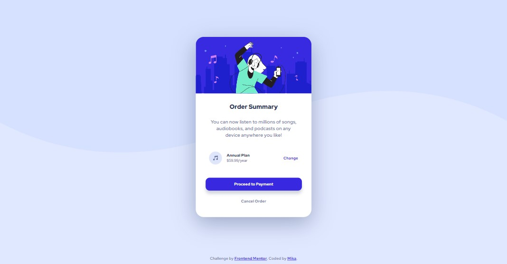

# Frontend Mentor - Order summary card solution

This is a solution to the [Order summary card challenge on Frontend Mentor](https://www.frontendmentor.io/challenges/order-summary-component-QlPmajDUj). Frontend Mentor challenges help you improve your coding skills by building realistic projects. 

## Table of contents

- [Overview](#overview)
    - [The challenge](#the-challenge)
    - [Screenshot](#screenshot)
    - [Links](#links)
- [My process](#my-process)
    - [Built with](#built-with)
    - [What I learned](#what-i-learned)
- [Acknowledgments](#acknowledgments)

## Overview 👀

### The challenge

Users should be able to:

- See hover states for interactive elements

### Screenshot

### Links

- Solution URL: [frontendmentor.io/solutions/responsive-order-summary](https://www.frontendmentor.io/solutions/responsive-order-summary-using-flexbox-rJYzSmzQ5)
- Live Site URL: [mika-marcondes.github.io/order-summary](https://mika-marcondes.github.io/order-summary/)

## My process 🤔

### Built with

- HTML
- CSS
- Flexbox
- Media query

### What I learned

This time around I was able to do things much faster, and I feel that I manage to organize my
code better. I could finally wrap my head around media query, which I've looked at it before but had not
used yet.

## Acknowledgments 📢

My girlfriend for being incredible smart, and my cats.